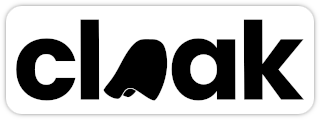

  <a href="https://cloak.tools">
     
  </a>
  Cloak your users in anonymity with <b>privacy-first</b> forms.

  Try it out today at [cloak.tools]

## Synopsis

In order to keep feedback forms _truly_ accurate, you must promise the
respondents anonymity. Cloak helps form administrators obtain **better feedback**
by using AI to rewrite respondents' submissions in a consistent style.
Eliminating any language bias that may expose respondents' identities, while
keeping original intent.

This makes every feedback obtained through forms _more valuable_.

Cloak features a full-fledged forms creator, with administrator account (and
hence, their forms) management.

## License

Cloak is licensed under the MIT license. For more information, see the [LICENSE]
file at the repository root.

[cloak.tools]: https://cloak.tools/
[LICENSE]: LICENSE
